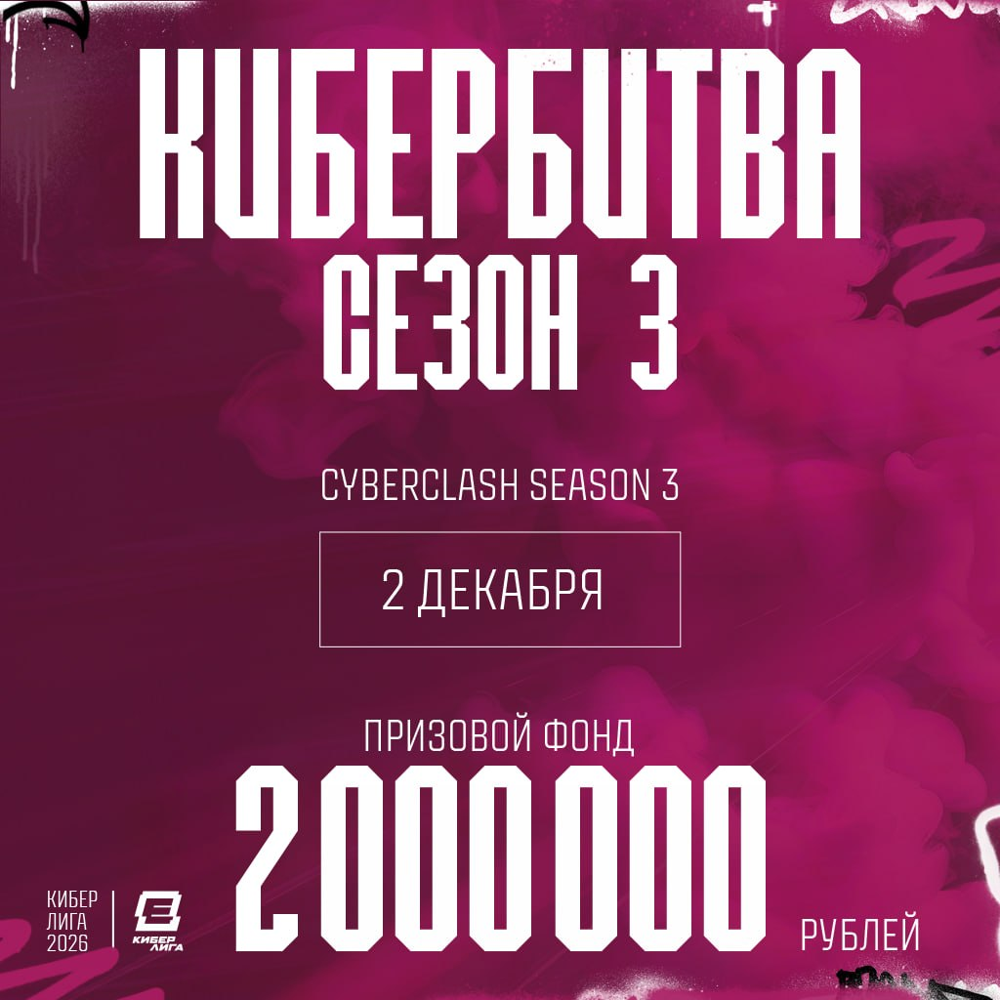

# CyberClash Season 3 announcement and additional info

  

# Tournament and VRS info

- **Tournament VRS Tier** - VRS Tier 2 
- **VRS publication date used for Invites:** November 2026
- **VRS publication date used for Seeding:** November 2026
- **Number of invited teams** - 16 teams, starting from rank 25 of Europe VRS Rating
- **Invite Date** - 2nd of November 2026

# Ranked Stages
- An official application will be submitted to HLTV.org for VRS inclusion. Please note that HLTV.org makes the final decision on which matches count towards the ranking.

# Tournament Format
Tournament contains following stages:

- Main Event Group Stage - 16 invited teams (Online - 2nd of December - 6th of December - 4 GSL BO3 Groups. Best 2 teams from each group advance to the play-off stage)
- Main Event Play-off Stage - Best 8 teams from Main Event Group Stage (LAN - 18th of December - 20th of December - Single Elimination BO3 with 3rd place decider)
  
# Prize Pool

Total Prize Pool of **Main event** is 2.000.000 RUB *(two million rubles)* - **~23 866 USD**

| Place | Prize |
| --- | --- |
|1 st place | 11 935 USD |
| 2nd place | 5 966 USD |
| 3rd place | 3 579 USD |
| 4th place | 2 386 USD |

# Visa/Location

**Location**: Europe (Online) for online part of tournament, Kazakhstan for LAN part of tournament
- Please note that travel support/accommodation is not provided for LAN stage

# Main Event Rulebook

*Main event rulebook will be shared with teams no later than 27th of November 2026.*

# Disqualification and Technical Defeat Policy 

[Disqualification and Technical Defeat Policy](disqualification-and-technical-defeat-policy.md)

# Verifiability
- This Additional Information is published on a platform that preserves version history
